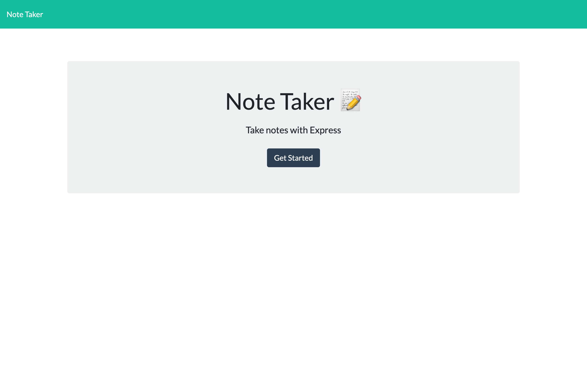

# notetaker
UNH Bootcamp Week 11 HW

Link to live website: (https://peaceful-dawn-53437.herokuapp.com/)

## Instructions
Create an application that can be used to write, save, and delete notes. This application will use an express backend and save and retrieve note data from a JSON file.

## More Information
In this homework assignment, I used express to serve html files and display data retrieved from a JSON file. Each note has a unique id associated with it. For this project I just simply used a unix time stamp as my id. The application is deployed through Heroku.